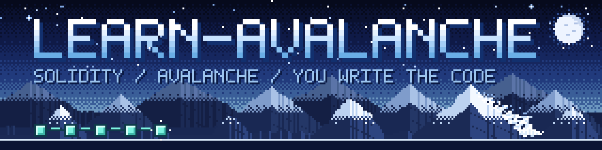

<p align="center">
  
</p>

<p align="center">
  <b>A teacher-style AI skill that takes you from zero Solidity to your own Avalanche L1.</b><br>
  The agent never writes your code. <b>You do.</b> It explains, asks questions, and looks at your mistakes with you.
</p>

<p align="center">
  <a href="CHANGELOG.md"></a>
  <a href="LICENSE"></a>
  
  
  
</p>

**learn-avalanche** teaches Solidity and Avalanche with **Remix IDE + the Core wallet**, up to deploying your own L1. It measures your level first, remembers your progress in its own file, and replies **in whatever language you write in**. It runs inside the AI coding agent you already use (Claude Code, Codex, OpenCode, Antigravity and others supported by the [`skills` CLI](https://github.com/vercel-labs/skills)). Testnet only.

> **Beta.** The teaching behavior and the on-chain tooling are tested; the browser steps (Core, Remix, Builder Console) have not yet been run end to end by a human. See [what is verified and what is not](#verification-status-beta).

---

## Install

```bash
npx skills add Anka-1623/learn-avalanche
```

Then open your agent and start the skill:

| Agent | Start it with |
|---|---|
| Claude Code | `/learn-avalanche` |
| Codex | `$learn-avalanche` |
| OpenCode, Antigravity | not yet verified; say "use the learn-avalanche skill, teach me Solidity" |

On first run it gets to know you, measures your level, and from then on remembers where you left off.

<details>
<summary><b>Install options</b> (everywhere, single agent, update, remove, manual)</summary>

| What you want | Command |
|---|---|
| For the project in the current folder (default) | `npx skills add Anka-1623/learn-avalanche` |
| **Everywhere** (user level, recommended) | `npx skills add Anka-1623/learn-avalanche -g` |
| Only specific agent(s) | `npx skills add Anka-1623/learn-avalanche -a claude-code codex` |
| Look inside before installing | `npx skills add Anka-1623/learn-avalanche --list` |
| No prompts | `npx skills add Anka-1623/learn-avalanche -y` |
| See installed skills | `npx skills ls` (add `-g` for user level) |
| Update | `npx skills update learn-avalanche` |
| Remove | `npx skills remove learn-avalanche` |

The `skills` CLI's own docs: [vercel-labs/skills](https://github.com/vercel-labs/skills).

**Where do the files go?** A project-level install puts the skill under `./.agents/skills/learn-avalanche/` (read by Codex, OpenCode and Antigravity); for Claude Code, `./.claude/skills/learn-avalanche` is a link pointing there. With `-g`, it is copied to `~/.claude/skills/learn-avalanche` for Claude Code.

**An installed copy is a snapshot.** It does not follow this repository: run `npx skills update learn-avalanche` to get fixes.

**Manual install** (without npx):
```bash
git clone https://github.com/Anka-1623/learn-avalanche.git
cp -r learn-avalanche/.claude/skills/learn-avalanche ~/.claude/skills/
```
</details>

### Requirements

| | |
|---|---|
| An AI coding agent | Claude Code, Codex, OpenCode, Antigravity, or anything else that reads `SKILL.md` |
| Node.js | only for the `npx` command |
| Python 3 | the agent runs `scripts/memory.py` (your progress file) and `scripts/chain.py` (read-only chain checks); standard library only (developed on 3.14) |
| Chrome + Core wallet extension | the skill walks you through setup in Stage 0 |

Foundry, Docker or other dev tooling is **not** required. You write code in Remix IDE, in the browser.

---

## What it teaches, what you build

You progress through a single project: a **non-transferable community badge** contract.

| # | Stage | What you do |
|---|---|---|
| 0 | Setup | Core wallet, Builder account, test AVAX, Remix tour, **measuring** the live chain |
| 1 | Solidity basics | `BadgeBook`: state, struct, mapping, modifier, custom error, event (Remix VM); if your wallet is ready, your first Fuji deploy (around hour 3) |
| 2 | Contract design | `Badge`: OpenZeppelin ERC-721, roles, soulbound |
| 3 | Security | You **write** a reentrancy bug yourself, exploit it, and fix it |
| 4 | Deploy to Fuji | You send the same contract to a real Avalanche network |
| 5 | Your own L1 | You launch **your own L1** with Builder Console and run the contract there; at the end you write a 5-line idea card |

About 11–14 hours in total, spread over several sessions. Scope deliberately stops at **deploying your own chain**; ICM/ICTT and automated testing come in later versions ([`roadmap-next.md`](.claude/skills/learn-avalanche/references/roadmap-next.md)).

**Who it is for:** anyone joining (or considering joining) a Team1 community (Türkiye, France, USA) who wants to start Solidity + Avalanche **from scratch**. It adapts to your level, from people who have never coded to people who already write contracts. The community you pick only changes the badge name, example names and the closing suggestion, never the language.

## The golden rule: the agent never writes your code

The agent:
- never writes the solution (not one line, not even "as an example");
- never "fixes your code and hands it back";
- gives you the **task** and **how to verify it in Remix**, points to **where** the bug is, and **asks**;
- if you are really stuck, **dictates**: describes the code in words, and you press the keys.

Real, unedited transcripts, including what the teacher answers when a student says "just write it for me": [`docs/sample-session.md`](docs/sample-session.md).

> Answer keys are installed to disk with the skill (so the teacher can check your code). The agent will not show them, but the files are there. You can look if you want; you would be the one losing the learning.

## Level and memory

**Level is always the first step.** Your self-declaration is only a starting point; the decision comes from a diagnostic of at most 6 short questions (not an exam: no score is shown, "I don't know" is a valid answer). No lesson starts before your level is measured, even if you ask for `stage 3`. During lessons the level is adjusted live from what you show ([`placement.md`](.claude/skills/learn-avalanche/references/placement.md)).

**Memory is the skill's own file, kept automatically.** You never say "save". It holds your level, progress, concept notebook (in your own words), weak spots, measurements and on-chain addresses, and it stays on your computer.

| | |
|---|---|
| File | `~/.learn-avalanche/memory.md`. If that is not writable, `.learn-avalanche/memory.md` in the folder you work in |
| Custom location | set `LEARN_AVALANCHE_HOME`; when set, **only** that folder is used (an empty one means "no memory yet", which makes it easy to keep separate learners apart) |
| Across agents | every agent reads the same file, so you can continue in one agent where you stopped in another (a Codex-written file was resumed in Claude Code) |
| Old version | a 0.1.0 `progress.md` is moved into `memory.md`; the diagnostic is redone |
| Safety | recovery phrases, private keys and passwords are **never** written. You can edit or delete the file by hand |

## Commands

Arguments are understood by meaning, in any language; `devam`/`continue` and so on are interchangeable.

| Command | What it does |
|---|---|
| `/learn-avalanche` | First run: onboarding + level diagnostic; afterwards, continue where you left off |
| `/learn-avalanche status` (`durum`) | Progress summary, nothing is changed |
| `/learn-avalanche level` (`seviye`) | Redo the level diagnostic (old results are kept) |
| `/learn-avalanche stage 3` | Jump to a stage (your level is measured first) |
| `/learn-avalanche reset` (`sıfırla`) | After confirmation, back up your progress as `memory.md.bak-<date>` and start over |

## Safety

- **Remix VM and testnet only** (Fuji + your own L1). No mainnet.
- **Recovery phrases and private keys are never typed into the chat.** The wallet is created fresh for this course and holds no real value.
- The agent only **reads** the chain (`scripts/chain.py`): it holds no keys and cannot send transactions. Every signature happens in your wallet, by your decision.
- Agent skills run with your agent's permissions; reviewing the files after `npx skills add` is a good habit. This skill's scripts are short and readable: [`scripts/`](.claude/skills/learn-avalanche/scripts/).

Found a security problem? Please use the private route in [`SECURITY.md`](SECURITY.md) rather than a public issue.

---

## Verification status (beta)

Beta does not mean "half-done": what is verified, and what a human has not yet tried in a real browser, is written out openly.

| What | Status |
|---|---|
| `npx skills add` install (project, `-g`, `ls`, `remove`; Claude Code, Codex, OpenCode, Antigravity targets) | ✅ From a local path: all files copied, scripts run from the installed location |
| `npx skills add Anka-1623/learn-avalanche` from GitHub | ⏳ To be tested end to end once the repo is public (same discovery code as the local path) |
| Answer keys (Solidity) | ✅ 6 Foundry suites + 4 mutations (broken code is caught), with OpenZeppelin 5.6.1 |
| Chain tool `scripts/chain.py` | ✅ Cross-checked against Fuji with `cast` (keccak, EIP-55, ABI) |
| Teaching behavior in Claude Code | ✅ Headless runs: first open, level gate, diagnostic (one question at a time, no score), automatic memory, "write it for me" pressure, recovery-phrase and mainnet requests, `status` / `reset` |
| Replies in the learner's language | ✅ Turkish, French, Spanish, Arabic, Japanese (short runs; no per-language files exist) |
| Codex | ✅ First replies (`$learn-avalanche`), memory written by Codex resumed in Claude Code · ⏳ full lessons |
| OpenCode, Antigravity | ⏳ File placement verified; triggering not tried |
| Avalanche facts | ✅ From live docs, dated ([`live-facts.md`](.claude/skills/learn-avalanche/references/live-facts.md)); `scripts/verify-facts.py` 5/5 OK and all linked program pages reachable (2026-10-04) |
| Clickable onboarding (`AskUserQuestion`), early Fuji step (1.5), idea card, live level adjustment, diagnostic tiers B and C | ⏳ Not tried yet |
| Core setup, Remix UI labels, L1 creation in Builder Console, real Fuji deploy | ⏳ **Not yet run end to end by a human in a real browser** ([checklist](docs/verification-checklist.md)) |

**If you try it, tell us.** "At this step the label said this" is the most valuable feedback. See [`CONTRIBUTING.md`](CONTRIBUTING.md); a *Test result* issue form is ready.

## Troubleshooting

- **A reply takes minutes in Codex.** If Codex's own log shows `stream disconnected before completion: idle timeout waiting for websocket`, the stall is between Codex and its model backend (it waits about five minutes and then retries, usually succeeding at once). It is not the skill: a first reply with this skill took about 20 seconds in Codex when the stream did not stall.
- **The skill behaves like an older version.** Installed copies are snapshots; run `npx skills update learn-avalanche`.
- **`/learn-avalanche` is not recognized.** Spelling varies by agent (`$learn-avalanche` in Codex). Otherwise say "use the learn-avalanche skill, teach me Solidity".
- **It replied in the wrong language.** It follows your last message; with no language signal at all (a bare command) it starts in English. Write one line in your language.

## Assumptions

- The "USD" community was interpreted as **Team1 USA**; if that is wrong, it is a one-line change in [`communities.md`](.claude/skills/learn-avalanche/references/communities.md).
- There is no verified link or assignment for "Team1 France", so none was added; nothing was invented.
- The skill's instructions are written in Turkish on purpose: they exist once, and the agent translates at runtime. See [`CONTRIBUTING.md`](CONTRIBUTING.md#language).

## Repository layout

```
.claude/skills/learn-avalanche/     the skill itself (npx installs only this folder)
├── SKILL.md                        the teacher's rules and flow
├── references/                     curriculum, stage files, Remix guide, communities, live facts
├── answer-keys/                    verified solutions for the AGENT only (never shown to the student)
├── scripts/                        memory.py, chain.py (read-only), fetch-doc.py, verify-facts.py
├── assets/                         memory template
└── maintainers/forge-suite/        regression suite that re-verifies the answer keys (needs Foundry)
docs/                               sample session, verification checklist, images
tools/                              check-skill.py (quality gate), test-memory.py, make-art.py (image generator)
.github/                            issue forms, pull request template
```

## For maintainers

```bash
python3 tools/check-skill.py      # frontmatter, internal paths, links, compile, no personal paths
python3 tools/test-memory.py      # unit tests for scripts/memory.py
bash .claude/skills/learn-avalanche/maintainers/forge-suite/run.sh   # only if answer keys changed (needs Foundry)
python3 .claude/skills/learn-avalanche/scripts/verify-facts.py       # re-check the live Avalanche facts
```

- Changed an Avalanche-specific fact? Update its date in `references/live-facts.md`. That file goes stale; every command has a "re-verify" path next to it.
- Adding a community: one row in `references/communities.md`.
- Regenerating the images: `pip install pillow && python3 tools/make-art.py` (deterministic).
- Pre-release install check: `npx skills add . --list` from the repository root. The full release checklist is in [`CONTRIBUTING.md`](CONTRIBUTING.md#releasing).

## Images and trademarks

The banner and social preview are **original pixel art** generated by `tools/make-art.py` (MIT). No logo of Avalanche or any other brand is used or imitated.

Avalanche, Core and Team1 are names of their respective owners. This repository is a community project; it is not an official product of Ava Labs or the Avalanche Foundation, and no endorsement by them is claimed.

## License

MIT, see [`LICENSE`](LICENSE).
